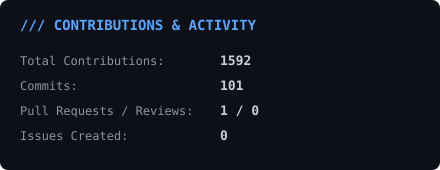
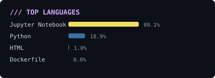
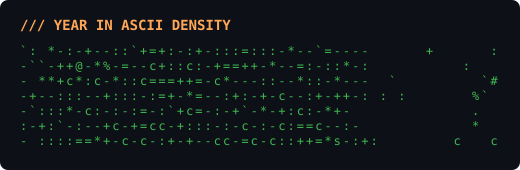

# 👋 Hi there, I'm Vatsal Porwal (@vatsalporwal68)

<p align="left">
  <b>Data Analyst</b> • <b>Business Intelligence Specialist</b> • <b>Data Storyteller</b>
</p>

> Transforming complex raw data into actionable insights, interactive dashboards, and data-driven business solutions. A self-generating GitHub profile powered by Python and GitHub Actions.

---

### /// SELF-TYPING ASCII PORTRAIT

<div align="center">
  
</div>

---

### /// ABOUT ME & CURRENT FOCUS

<samp>
- 📊 <b>Currently Working On:</b> Exploratory Data Analysis (EDA), automated ETL pipelines, and predictive analytics.<br/>
- 💡 <b>Passionate About:</b> Data Storytelling, Business Intelligence, Statistical Modeling, & Database Optimization.<br/>
- 🎓 <b>Focusing On:</b> Advanced SQL, Data Pipelines, Python for Data Science (Pandas, NumPy), and Interactive BI Dashboards.<br/>
- 📫 <b>Get In Touch:</b> <a href="https://github.com/vatsalporwal68">@vatsalporwal68</a> on GitHub
</samp>

---

### /// TECH STACK & ANALYTICS TOOLKIT

<p align="left">
  <b>Data Analysis & Statistics:</b><br/>
  <code>Python</code> • <code>SQL</code> • <code>Pandas</code> • <code>NumPy</code> • <code>R</code> • <code>Excel (Advanced)</code>
</p>

<p align="left">
  <b>Visualization & Business Intelligence:</b><br/>
  <code>Power BI</code> • <code>Tableau</code> • <code>Matplotlib</code> • <code>Seaborn</code> • <code>Plotly</code>
</p>

<p align="left">
  <b>Databases & Tools:</b><br/>
  <code>PostgreSQL</code> • <code>MySQL</code> • <code>MongoDB</code> • <code>Jupyter Notebooks</code> • <code>Git</code> • <code>Google BigQuery</code>
</p>

---

### /// LIVE STATS & CONTRIBUTION METRICS

<div align="center">

| Activity Metrics | Streak Tracker |
| :---: | :---: |
|  |  |

</div>

<br/>

<div align="center">

| Top Languages | 365-Day Contribution Density |
| :---: | :---: |
|  |  |

</div>

---

### ⚙️ HOW IT WORKS UNDER THE HOOD

```
+------------------------+     +------------------------+     +-------------------+
| GitHub Profile Avatar  | --> | scripts/generate_ascii | --> | assets/portrait   |
| (vatsalporwal68.png)   |     | (Bilateral, SMIL, PIL) |     | (.svg)            |
+------------------------+     +------------------------+     +-------------------+

+------------------------+     +------------------------+     +-------------------+
| GitHub GraphQL API     | --> | scripts/generate_stats | --> | assets/*.svg      |
| (Nightly Cron Job)     |     | (Pinned UTC, Public)   |     | (Stats/Streak/Yr) |
+------------------------+     +------------------------+     +-------------------+
```

- **Zero Fragility:** All SVG graphics are generated directly within this repository using Python and committed back by GitHub Actions (`.github/workflows/refresh.yml`).
- **Determinism Fixes:** Date queries are pinned to whole UTC days (`00:00:00Z` to `23:59:59Z`) and filtered to public repositories to ensure stable Git commits.
- **SMIL Animation:** The ASCII portrait uses native SVG `<clipPath>` SMIL animations that type out smoothly in light and dark mode without client-side JavaScript.

---

<div align="center">
  <samp>Crafted for Vatsal Porwal • Data Analyst • Self-Generated via GitHub Actions</samp>
</div>
